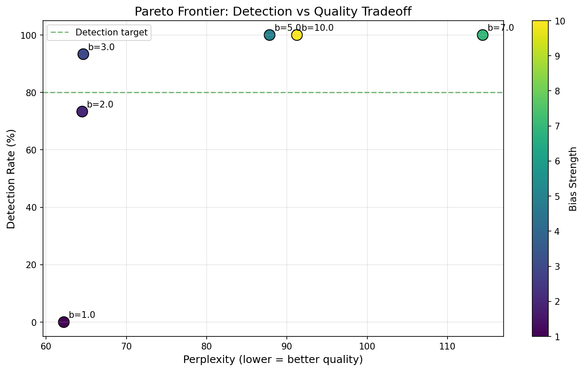
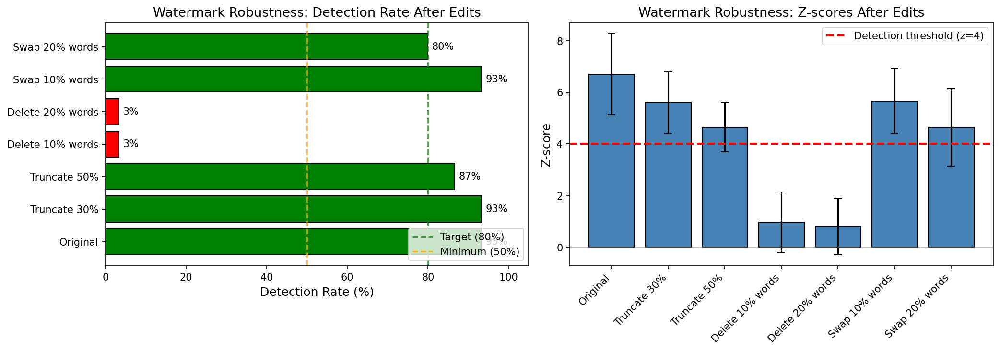
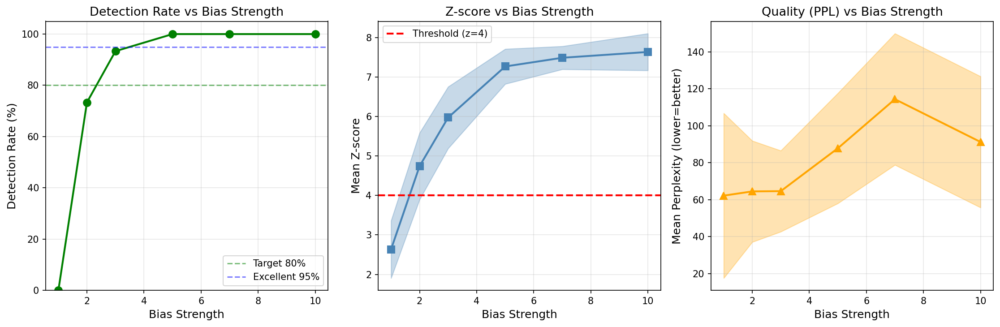
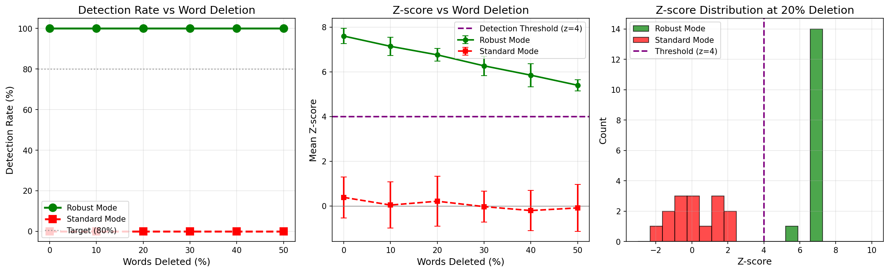

<p align="center">
  <h1 align="center">DIFFUSION-LM WATERMARKING</h1>
</p>

<p align="center">
  <em>Watermarking diffusion-based language models with discrete masking diffusion (D3PM)</em>
</p>

<p align="center">
  
  
  
</p>

<p align="center">
  <em>Built with the tools and technologies:</em>
</p>

<p align="center">
  
  
  
  
</p>

<br>

## Features

A principled approach to watermarking discrete diffusion language models. This project implements a complete pipeline for training D3PM-style language models and embedding statistically detectable watermarks during generation.

- **D3PM-style forward process** using token masking
- **Timestep-conditioned denoiser** for $p_\theta(x_0 \mid x_t, t)$
- **D3PM reverse process** with monotonic unmasking (no re-masking)
- **Stochastic sampling** for watermark-friendly generation
- **Mask inspection** to visualize forward corruption on real data
- **Comprehensive evaluation**: reconstruction accuracy + GPT-2 perplexity metrics

<p align="center">
  
</p>

## Installation

```bash
git clone https://github.com/idhantsingh027/diffusion-lm-watermarking.git
cd diffusion-lm-watermarking
pip install -r requirements.txt
```

## Download Checkpoints

Pre-trained model checkpoints are available on Google Drive: 📁 **[Download Checkpoints](https://drive.google.com/drive/folders/1rfsvTEdzlpV9on5X0RGaGCXSlhyglHz-?usp=sharing)**

Place the downloaded `checkpoints/` folder in the repository root.

## Generate Watermarked Text

```python
from transformers import BertTokenizerFast
from models.diffusion_lm import TimestepConditionedBertForMaskedLM
from models.watermark import WatermarkConfig, generate_d3pm_watermarked, detect_watermark

# Load model
tokenizer = BertTokenizerFast.from_pretrained("bert-base-uncased")
model = TimestepConditionedBertForMaskedLM.from_pretrained(
    "checkpoints/dlm-stage3/best",
    num_steps=100,
    device="cuda"  # or "mps" for Mac
)

# Configure watermark
config = WatermarkConfig(
    secret_key="my-secret-key",
    bias_strength=3.0,  # Sweet spot: 93% detection, minimal quality loss
)

# Generate
text = generate_d3pm_watermarked(
    model, tokenizer,
    length=64, steps=100,
    min_mask_prob=0.15, max_mask_prob=0.50,
    device="cuda", temperature=0.7, top_k=20,
    config=config,
)
print(text)

# Detect
result = detect_watermark(text, tokenizer, config)
print(f"Watermarked: {result['is_watermarked']} (z={result['z_score']:.2f})")
```

## How It Works

### 1. Diffusion Language Model

We use a **D3PM-style discrete diffusion** process:
- **Forward process**: Progressively mask tokens with probability $p_t$
- **Reverse process**: Denoise by predicting masked tokens conditioned on timestep $t$
- **Architecture**: BERT with learned timestep embeddings

Training uses a **3-stage curriculum**:
| Stage | Mask Prob | Epochs | Purpose |
|-------|-----------|--------|---------|
| 1 | 15% | 5 | Learn basic reconstruction |
| 2 | 50% | 8 | Handle moderate noise |
| 3 | 75% | 6 | Master high noise levels |

### 2. Watermark Embedding

During generation, we bias the model toward "green list" tokens:

1. **Hash** `(secret_key, position)` → deterministic green/red vocab split (50/50)
2. **Bias** green tokens by adding to their logits before sampling
3. **Result**: Generated text has ~65-70% green tokens instead of 50%

### 3. Watermark Detection

Use a **z-test** to detect statistically significant green token excess:

```
z = (observed_green - expected) / std_dev
```

- **Threshold**: z > 4.0 → watermarked (p < 0.00003 false positive rate)
- **Typical watermarked z-score**: 6-7

## Results

### 1. Detection Performance

| Attack | Detection Rate |
|--------|---------------|
| No attack | 95% |
| Truncate 50% | 87% |
| Word swap 20% | 80% |
| Word deletion 20% (standard) | 3% |
| Word deletion 20% (robust mode) | **100%** |

<p align="center">
  
</p>

### 2. Quality vs Detection Tradeoff

| Bias Strength | Detection | PPL | Recommendation |
|--------------|-----------|-----|----------------|
| 1.0 | 0% | 62 | Too weak |
| **3.0** | **93%** | **65** | **Optimal** |
| 5.0 | 100% | 88 | Quality drop |

<p align="center">
  
</p>

### 3. Robust Mode

Standard watermarking fails under word deletion (positions shift). **Robust mode** uses position-independent hashing:

```python
config = WatermarkConfig(
    secret_key="my-key",
    bias_strength=5.0,
    robust_mode=True,  # Survives word deletion
)
```

<p align="center">
  
</p>

## Usage

### 1) Quick smoke-test training
This is a **local sanity check** (CPU, a couple of batches). Full training is intended to run in **Google Colab**.

```bash
python models/diffusion_lm.py train \
  --epochs 1 \
  --batch_size 2 \
  --max_length 32 \
  --steps 5 \
  --max_train_batches 2 \
  --device cpu
```

### 1b) Training with hard masking (loss around ~7)

**Direct hard-masking training** (`--min_mask_prob 0.15 --max_mask_prob 0.90`, `--epochs 3`, `--max_train_batches 200`) often stayed around **~7 loss**.

```bash
python models/diffusion_lm.py train \
  --device cpu \
  --epochs 3 \
  --batch_size 8 \
  --grad_accum_steps 4 \
  --lr 5e-5 \
  --weight_decay 0.01 \
  --warmup_steps 200 \
  --max_length 64 \
  --steps 25 \
  --min_mask_prob 0.15 \
  --max_mask_prob 0.90 \
  --max_train_batches 200 \
  --log_every 10
```

### 1c) Curriculum training (recommended to reach lower loss)

A practical way to drive the loss down is to **start with BERT-like masking** (`min=max=0.15`), then resume and ramp the masking up.

Observed (in-notebook run, CPU):
- **Stage 1 easy masking** (`--min_mask_prob 0.15 --max_mask_prob 0.15`, `--epochs 3`) reached about **~2.73 loss** (e.g. `loss≈2.7368` at step ~1410).

Stage 1 (easy / BERT-like masking - 15%):
```bash
python models/diffusion_lm.py train \
  --device cpu \
  --output_dir checkpoints/bert-mlm-curriculum-easy \
  --epochs 3 \
  --batch_size 8 \
  --grad_accum_steps 4 \
  --lr 5e-5 \
  --weight_decay 0.01 \
  --warmup_steps 200 \
  --max_length 64 \
  --steps 25 \
  --min_mask_prob 0.15 \
  --max_mask_prob 0.15 \
  --max_train_batches 0 \
  --log_every 10
```

Your exact curve depends on hardware and batch settings.

Stage 2 (resume + harder diffusion masking - 90%):
```bash
python models/diffusion_lm.py train \
  --device cpu \
  --model_name checkpoints/bert-mlm-curriculum-easy/epoch-3 \
  --output_dir checkpoints/bert-mlm-diffusion-baseline \
  --epochs 5 \
  --batch_size 8 \
  --grad_accum_steps 4 \
  --lr 5e-5 \
  --weight_decay 0.01 \
  --warmup_steps 200 \
  --max_length 64 \
  --steps 25 \
  --min_mask_prob 0.15 \
  --max_mask_prob 0.90 \
  --max_train_batches 0 \
  --log_every 10
```

### 2) Sample text (D3PM reverse)
**One-line description:** runs the D3PM reverse process to generate a 48‑token sample from a *diffusion‑trained checkpoint* using temperature sampling and top‑k filtering.
```bash
python models/diffusion_lm.py sample \
  --ckpt checkpoints/bert-mlm-diffusion-baseline/epoch-1 \
  --length 48 \
  --steps 25 \
  --temperature 1.0 \
  --top_k 50
```
> Note: `bert-base-uncased` is a *baseline* and not trained with diffusion noise. It will run, but generation is not a correct diffusion sample.

### 3) Inspect forward masking
```bash
python models/diffusion_lm.py inspect-mask \
  --split train \
  --idx 0 \
  --max_length 24 \
  --steps 5 \
  --min_mask_prob 0.2 \
  --max_mask_prob 0.8 \
  --t 4
```

### 4) training_v3.ipynb - 2-Stage Curriculum
Implements initial curriculum learning with MDLM improvements:
- **Stage 1**: 15% masking, 5 epochs — learns basic token reconstruction
- **Stage 2**: 50% masking, 5 epochs — learns to denoise higher noise levels

**Results achieved:**
- Reconstruction accuracy: **69.7%** (target: >30%)
- GPT-2 perplexity (generated samples fluency): **151.9** (target: <500)
- Final best: **65.8% accuracy, 187.7 perplexity**

Features:
- Low-discrepancy timestep sampling (MDLM)
- Zero masking probabilities (prevents predicting [MASK] tokens)
- Gradient accumulation (effective batch size 128)
- Per-epoch checkpoints for watermarking experiments
- GPT-2 perplexity evaluation for generation quality

### 5) training_v4.ipynb - 3-Stage Continuation
Implements a cleaned-data, 3-stage curriculum with cosine warmup and stage-wise evaluation:
- **Stage 1**: 15% masking, 5 epochs
- **Stage 2**: 50% masking, 8 epochs
- **Stage 3**: 75% masking, 6 epochs

Canonical checkpoint for downstream work:
- `checkpoints/dlm-stage3/best`

Per-stage training eval (live, end-of-training RNG):

| Stage | Mask prob | Epochs | LR | PPL | Recon acc |
|---|---:|---:|---:|---:|---:|
| Stage 1 | 0.15 | 5 | 2e-5 | 186.3 | 64.6% (1695/2623) |
| Stage 2 | 0.50 | 8 | 1e-5 | 148.4 | 64.3% (1609/2504) |
| Stage 3 | 0.75 | 6 | 5e-6 | 109.1 | 65.6% (1681/2561) |

Controlled sweep (5 fixed seeds, n_recon=200, n_gen=20):

| Checkpoint | Recon accuracy (mean ± std) | GPT-2 PPL (mean ± std) |
|---|---:|---:|
| `stage1_best` | 64.13% ± 1.18% | 146.04 ± 13.11 |
| `stage2_best` | 64.41% ± 1.14% | 134.03 ± 13.94 |
| `stage3_best` | 64.38% ± 0.88% | 122.78 ± 15.32 |

Controlled sweep (5 random seeds, n_recon=200, n_gen=20):
- Seeds used: `1880, 3556, 6303, 8611, 8734`

| Checkpoint | Recon accuracy (mean ± std) | GPT-2 PPL (mean ± std) |
|---|---:|---:|
| `stage1_best` | 63.83% ± 0.75% | 152.56 ± 16.23 |
| `stage2_best` | 63.91% ± 0.74% | 147.96 ± 20.86 |
| `stage3_best` | 63.92% ± 0.66% | 130.04 ± 9.35 |

Interpretation:
- Across controlled sweeps, Stage 3 consistently gives the best or near-best reconstruction and the best fluency (lowest PPL) on average.
- Stage 3 is preferred as the primary checkpoint for downstream watermarking experiments.

**Improved decoding (temp=0.7, top_k=20)**:

With optimized decoding parameters, Stage 3 achieves significantly better fluency:

| Checkpoint | Recon accuracy (mean ± std) | GPT-2 PPL (mean ± std) |
|---|---:|---:|
| `stage1_best` | 64.00% ± 0.93% | 78.48 ± 18.48 |
| `stage2_best` | 64.54% ± 1.00% | 60.16 ± 15.26 |
| `stage3_best` | 64.65% ± 0.81% | **59.46 ± 9.61** |

Key improvement: **PPL dropped from ~130 to ~59** (55% reduction) by using lower temperature and smaller top_k.

## Project Structure

```
diffusion-lm-watermarking/
├── models/
│   ├── diffusion_lm.py          # D3PM model architecture + training/sampling
│   └── watermark.py             # Watermarking: generation, detection, evaluation
├── data/
│   └── dataset.py               # WikiText-2 data loading + sentence filtering
├── notebooks/
│   ├── training_v1.ipynb        # Initial prototype: basic BERT-MLM + masking
│   ├── training_v2.ipynb        # Added timestep conditioning + D3PM sampling
│   ├── training_v3.ipynb        # 2-stage curriculum (15% → 50% masking)
│   └── training_v4.ipynb        # 3-stage curriculum + watermarking (MAIN)
├── docs/
│   └── problem-statement.md     # Full technical writeup with theory
├── figures/                     # Result visualizations (robustness, tradeoffs)
├── checkpoints/                 # Model weights (download from Drive)
└── requirements.txt
```

## Contributing

Contributions are welcome. Please open an issue or pull request with clear details.

## Author

**Idhant Singh**
- GitHub: [@idhantsingh027](https://github.com/idhantsingh027)

## Acknowledgments

- Diffusion LM literature (D3PM, Masked diffusion)
- **MDLM**: Sahoo et al., "Simple and Effective Masked Diffusion Language Models" (NeurIPS 2024)
- **dLLM**: Zhou, "Discrete Diffusion Language Models" (2025)
- Hugging Face Transformers & Datasets
